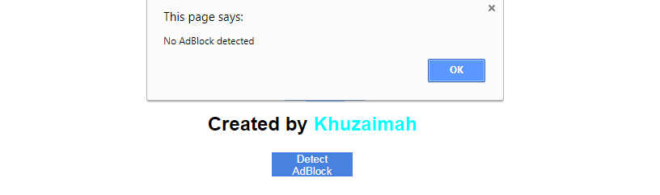

# KhuzaimahAdBlockDetector
Simple JS codes for detecting a browser's adblock.

```
function DetectAdBlock() {
 if( KhuzaimahAdDetector.IsAdBlockDetected() ) {
  alert('AdBlock detected');
 }
 else {
  alert('No AdBlock detected');
 }
}
```


